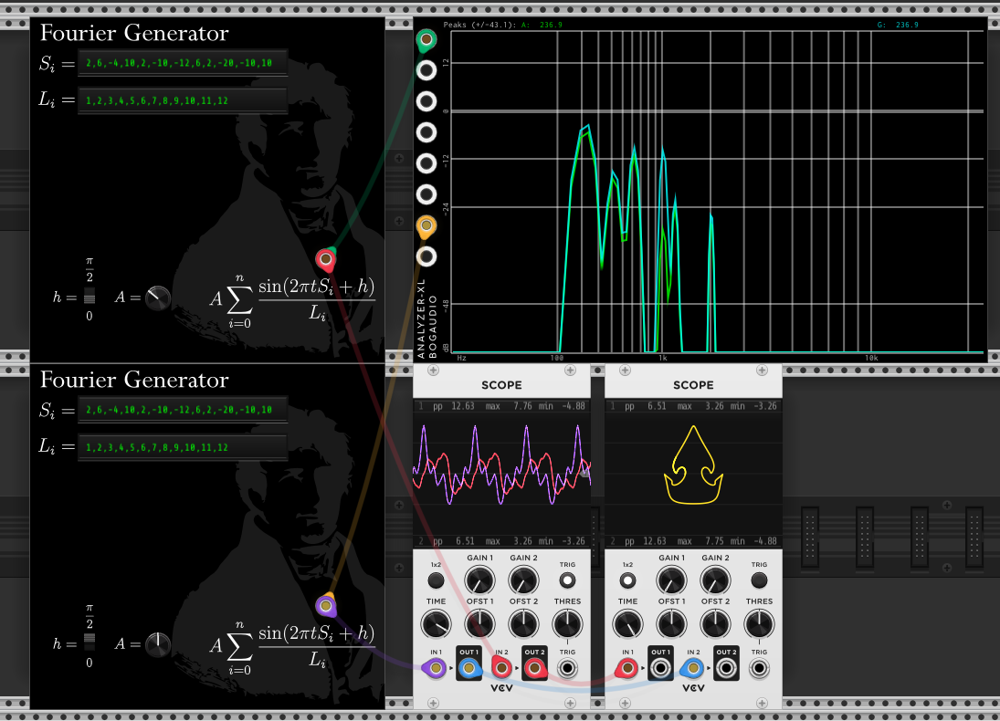

# Fourier Generator for VCVRack v2

Generate fourier curves based on frequency, and Amplitude

### Values

- `S_i` Frequency
- `L_i` Inverse of Amplitude
- `A` Master Amplitude
- `h` Master Delay
  > Use `h = pi/2` for the `x` axis  
  > Use `h = 0` for the `y` axis
